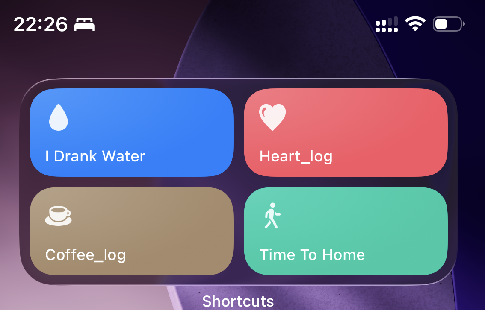
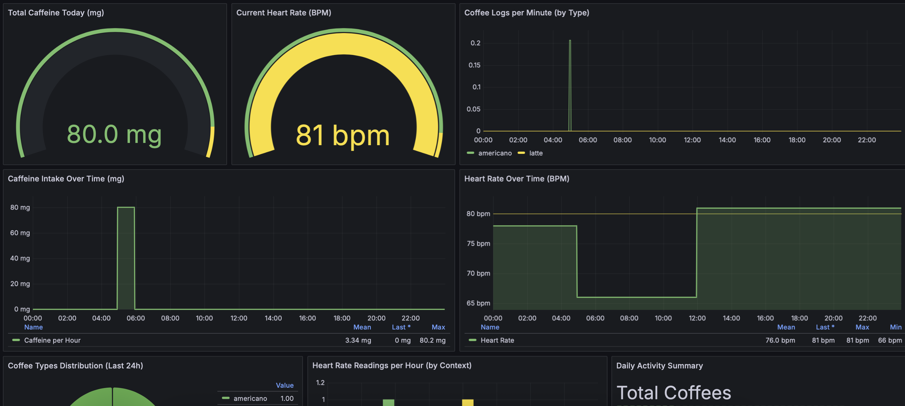

# Coffee Tracker API

Track your caffeine consumption and heart rate with statistical analysis. Log coffee intake, monitor heart rate, and analyze correlations between the two.

## iPhone Shortcuts Integration

Use Apple Shortcuts to log coffee and heart rate directly from your iPhone.


### Screenshots





## Features

- **Coffee Logging**: Track caffeine intake (0-1000mg validated)
- **Heart Rate Monitoring**: Log BPM readings (30-250 range)
- **Statistical Analysis**: Mean, median, standard deviation, correlations
- **Rate Limiting**: Redis-backed protection (30-60 req/min)
- **API Key Auth**: Bearer token security for all data endpoints
- **Timezone Aware**: ISO8601 timestamps throughout

## Quick Start

```bash
# 1. Clone and configure
git clone <repo-url>
cd coffee-tracker
cp .env.example .env
# Edit .env and set your API_KEY

# 2. Start services
make up

# 3. Verify
make health
```

**Common commands:**
- `make up` - Start services
- `make down` - Stop services
- `make logs` - View logs
- `make test` - Run tests
- `make backup` - Backup database

## API Documentation

**Base URL:** `https://coffee.danilocloud.me/api/v1/` (production) or `http://localhost:8000/api/v1/` (local)

**Docs:**
- Swagger UI: `/api/v1/docs`
- ReDoc: `/api/v1/redoc`
- API Info: `/api/v1/info`

**Authentication:**
```bash
export API_KEY="your-secret-api-key-here"
curl -H "Authorization: Bearer $API_KEY" https://coffee.danilocloud.me/api/v1/coffee/today
```

## API Examples

**Log Coffee:**
```bash
curl -H "Authorization: Bearer $API_KEY" \
     -X POST https://coffee.danilocloud.me/api/v1/coffee/ \
     -d '{"caffeine_mg": 95, "coffee_type": "espresso", "notes": "late night coding"}'
```

**Today's Total:**
```bash
curl -H "Authorization: Bearer $API_KEY" https://coffee.danilocloud.me/api/v1/coffee/today
# Returns: {"total_caffeine_mg": 285, "addiction_level": "moderate addict", ...}
```

**Log Heart Rate:**
```bash
curl -H "Authorization: Bearer $API_KEY" \
     -X POST https://coffee.danilocloud.me/api/v1/heartrate/ \
     -d '{"bpm": 85, "context": "resting"}'
```

**Correlation Analysis:**
```bash
curl -H "Authorization: Bearer $API_KEY" \
     "https://coffee.danilocloud.me/api/v1/heartrate/correlation?hours_after=3"
```


### Setup Instructions

1. Open the Shortcuts app on your iPhone
2. Create a new shortcut with "Get Contents of URL" action
3. Set URL to: `https://coffee.danilocloud.me/api/v1/coffee/`
4. Method: POST
5. Add Headers:
   - `Authorization`: `Bearer YOUR_API_KEY`
   - `Content-Type`: `application/json`
6. Request Body: JSON with your coffee data

Example shortcuts available in the `/shortcuts` folder (coming soon).

## Configuration

**Key environment variables (.env):**
```env
DATABASE_URL=sqlite:///data/coffee.db
API_KEY=your-secret-key-here  # CHANGE IN PRODUCTION
REDIS_URL=redis://redis:6379/0
CORS_ORIGINS=http://localhost:3000
```

**Database Schema:**
- `coffee_logs`: id, timestamp, caffeine_mg (0-1000), coffee_type, notes
- `heart_rate_logs`: id, timestamp, bpm (30-250), context, notes

## Deployment

**Production checklist:**
- Change API_KEY in .env
- Configure CORS_ORIGINS
- Set up HTTPS/TLS (nginx reverse proxy)
- Configure backups (`make backup` in cron)
- Set up monitoring

See [PRODUCTION_READY.md](PRODUCTION_READY.md) for complete deployment guide.

## Tech Stack

- Python 3.11+ / FastAPI
- PostgreSQL / SQLite
- Redis (rate limiting)
- Docker Compose

## Documentation

- [PRODUCTION_READY.md](PRODUCTION_READY.md) - Deployment guide
- [RUNBOOK.md](RUNBOOK.md) - Operations procedures
- [SECURITY.md](SECURITY.md) - Security policies
- [CONTRIBUTING.md](CONTRIBUTING.md) - Contribution guidelines
- [CHANGELOG.md](CHANGELOG.md) - Version history

## License

Apache License 2.0 - see [LICENSE](LICENSE) file.

---

**Note**: This API tracks your caffeine and heart rate data with statistical precision. The correlation analysis provides insights into how caffeine affects your cardiovascular system.